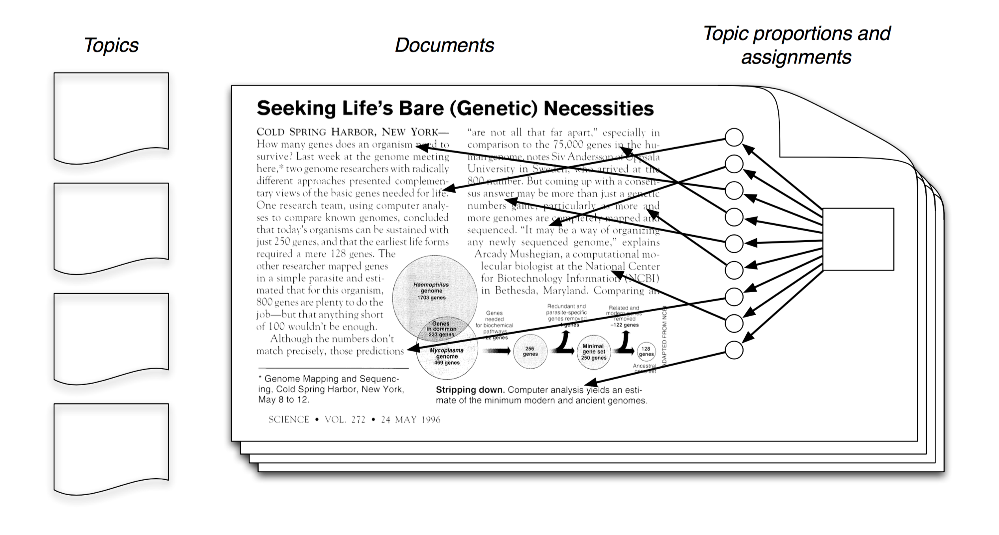

### Named Entity Recognition and Classification[NERC]
through

Latent Dirichlet Allocation[LDA]

<hr/>
<span style="color:maroon">Praveen Kumar Srinivasan</span>


Notes:

-----

### Overview of Presentation
<hr/>

Notes:
- Intro to Topic Modelling
- What is LDA?
- Why LDA?
- NER Techniques
- LDA in NER: Labelled LDA
- Advantages and Disadvantages

---

### Multi-Dimensional Exploratory Search on Unstructured Data
<hr/>

- **Multi-Dimensional Queries** are those queries that span over a specific semantic field or over multiple semantic fields of interest, but contains multiple items of interest.

```
Where can I watch a movie and have good Chinese food?
```

-----

### Twitter Data Characteristics

- **Length**: Maximum Length of a tweet is 140 characters.
- **Language**: They are hand typed, have misspellings, slang, emojis, abbreviations.
- **Open Domain**: The tweets can be on any topic.
- **Volume & Velocity**: The magnitude and speed of the data is vast.

---

### Key Problems
<hr/>

- Knowledge Extraction
    + <span style="color:maroon">Named Entity Recognition and Classification</span>
    + Word Sense Disambiguation
    + Textual Entailment
    + Coherence Resolution
- Personalization, Socialization, Contextualization, Localisation
- Temporal Reasoning, Statistical Paraphrasing
- Semantic relation and type

Notes:

---

### Current Work
<hr/>

Named Entity Recognition and Classification (NERC)

on

Twitter Data

---

### Traditional NERC Systems
<hr/>

- Use <span style="color:maroon">structure or grammar</span> to extract Named Entities
- Early systems relied on heuristics, while the modern system resort to machine learning
- Challenges: training datasets, previously unseen entities
- Supervised Learning rely on large training corpus
- Unsupervised learning techniques rely on lexical pattern, contextual statistics and features
- Rule based systems are preferred when there are not enough training samples

---

### Different Approaches
<hr/>

- Training data
    + Tagged corpus
- Lexical Resources
    + WordNet, Wikipedia, Freebase
- Grammar or Rules
    + Contains (Mr.), ContainsAlpha(U.S)
- Lexical Patterns
    + Collocation, Prefix, Postfix
- White-List or Dictionaries
    + Celebrities, City, Movies

-----

### Features used in NERC
<hr/>

- **Boolean Attribute** (isWordCapital)
- **Numeric Attribute** (lenOfWord)
- **Word Level Attributes** (case, punctuation, digits, characters, word endings, POS, morphology)
- **Document/Corpus Level Attributes** (word frequency, document frequency, co-occurrences, position in the text)
- **Lookup Attributes** (StopWords, dictionary lookup, abbreviations, prefix, postfix, location)

---

### Shortcoming of Traditional NERC Systems
<hr/>

- Dependency on Well-formed language structure
- Need for large training data
- Need for updated lexical resources
- Handling unseen patterns

---

### Characteristics of Social Media Data
<hr/>

- Slang
- Abbreviations
- Emojis
- HashTags
- Character Repetition
- Uppercase Characters

-----

### Twitter Data Features
<hr/>

- Social Circle
- Extended Social Circle
- Popularity of the tweet
- Popularity of the tweeter
- Trending HashTags
- Presence of HashTags
- Collocation with other HashTags
- Temporal Features
- Context: HashTags, search terms, user's social circle, extended social circle

---

### NERC on Twitter Data
<hr/>

- Current state-of-the-art:
    + Usage of <span style="color:maroon">global trends</span> and <span style="color:maroon">local trends</span>
    + Handle cases where lexical resources fail
    + Shortcomings
        + Do not classify the entity type
        + Do not consider HashTags

---

### How am I going to solve?
<hr/>

- Unsupervised Learning/Semi-Supervised Learning
- Address shortcoming of traditional NERC systems
- Classify entities across open-domain
- Handle cases where:
    + lexical resources fail
    + not enough training data
    + rules would be hard to frame

---

### Unsupervised Learning
<hr/>

Latent Dirichlet Allocation[LDA]

---

### What is LDA ?
<hr/>

- Generative Probabilistic Process
- Mixed Membership Model
- Introduced by David Blei, Andrew Ng, Micheal Jordan in 2003
- There are different variation of LDA based on constraints used

-----

### Generative Probabilistic Model
<hr/>

- Treats data as observations that arise from a generative probabilistic process that includes hidden variables
- Infer the hidden variables using posterior inference
- Fit the new data into the estimated model

---

### LDA - Intuition
<hr/>


<small>Source: LDA - David Blei, Andrew Ng, Micheal Jordan</small>

---

### Generative Model
<hr/>


- Each document is a mixture of topics
- Each word is drawn from one of those topics

<small>Source: LDA - David Blei, Andrew Ng, Micheal Jordan</small>

---

### Posterior Distribution
<hr/>



- However, in reality we have only Documents
- Our goal is to infer the underlying topics
- We use statistical models to infer the posterior

<small>Source: LDA - David Blei, Andrew Ng, Micheal Jordan</small>

---

### LDA : Plate Notation
<hr/>


<small>Source: LDA - David Blei, Andrew Ng, Micheal Jordan</small>

---

### LDA Notations

---

### Model?

---

### Labelled LDA : Plate Notation
<hr/>


<small>Labeled LDA: Daniel Ramage, David Hall, Ramesh Nallapati and Christopher D. Manning</small>

---

### Labelled LDA Notations

---


---

### My Approach

- Local and Global Features
- Use Freebase and Wikipedia
- Use Supervised Input Features
- Ensemble approach

---

### Advantages and Disadvantages

---

### Thats all! (For Now!)

Thanks and Feedbacks

