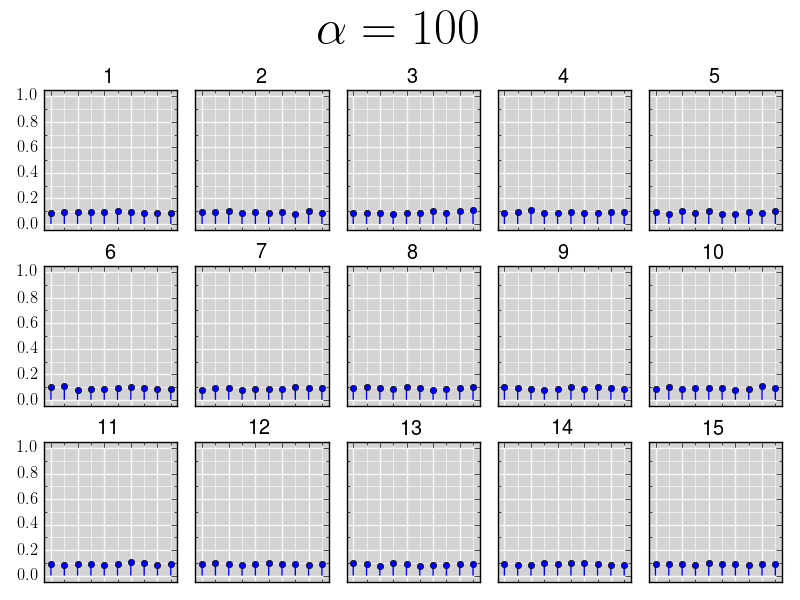
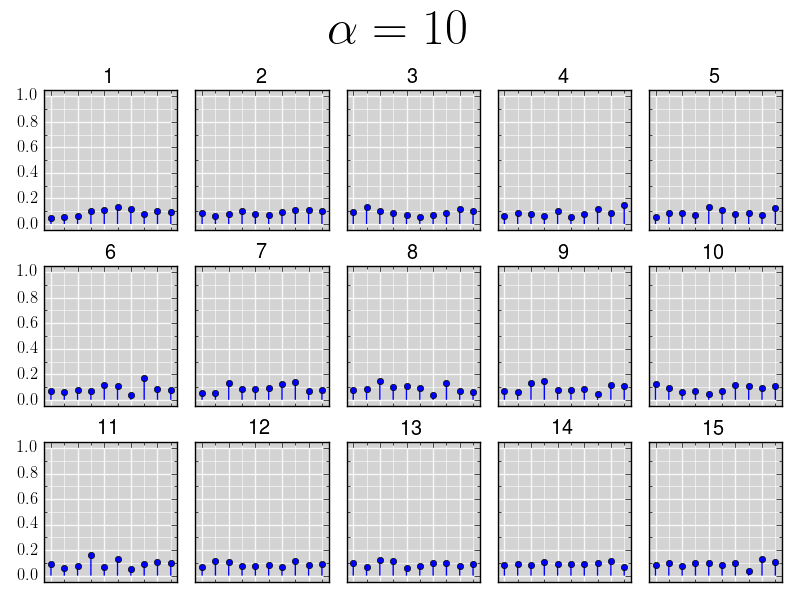
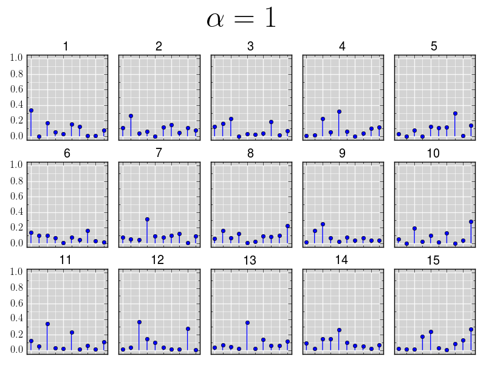
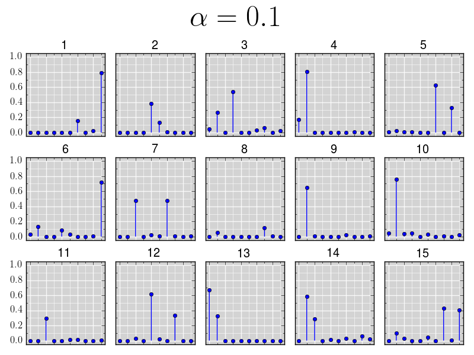
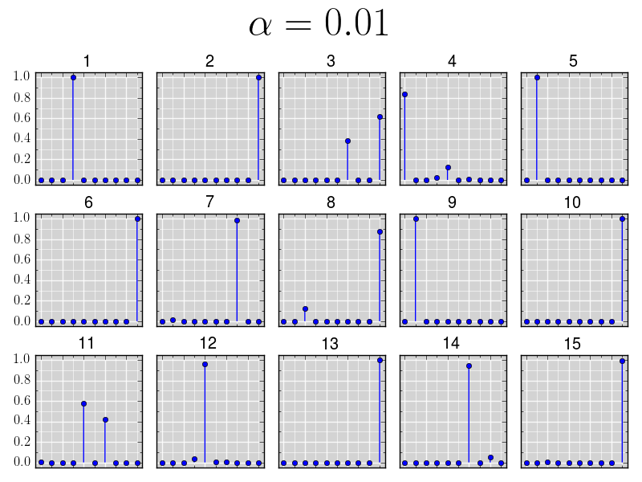
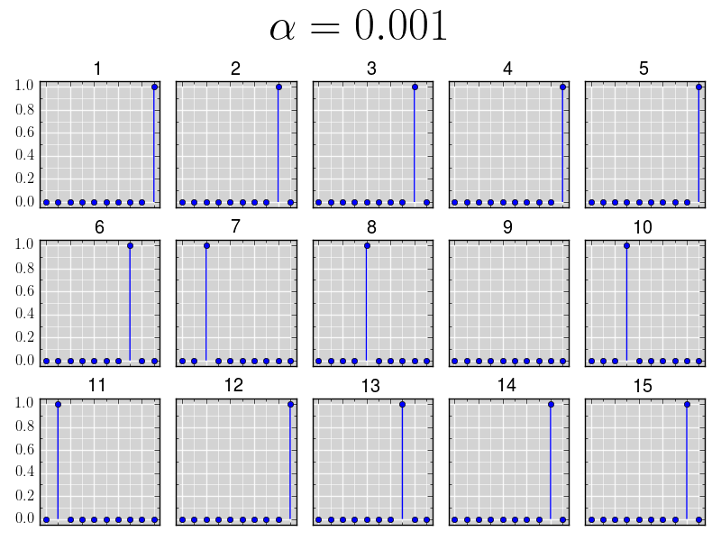
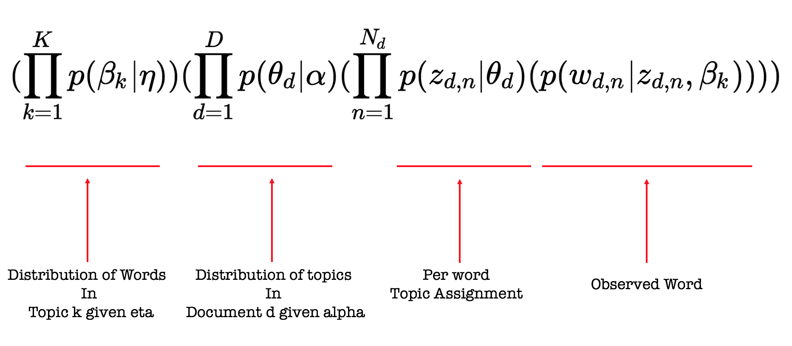
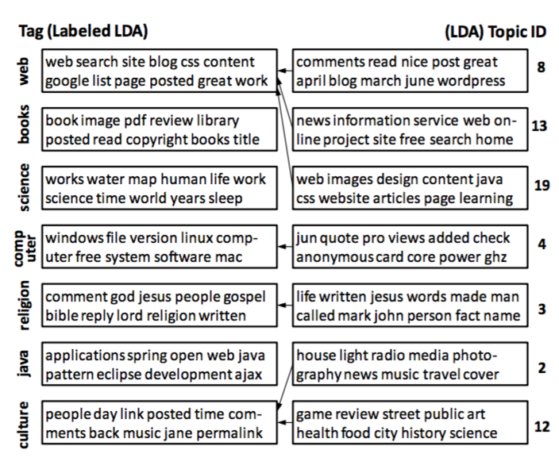

### Named Entity Recognition and Classification[NERC]
through

Latent Dirichlet Allocation[LDA]

<hr/>
<span style="color:maroon">Praveen Kumar Srinivasan</span>


Notes:

-----

### Overview of Presentation
<hr/>

Notes:
- Intro to Topic Modelling
- What is LDA?
- Why LDA?
- NER Techniques
- LDA in NER: Labelled LDA
- Advantages and Disadvantages

-----

### Multi-Dimensional Exploratory Search on Unstructured Data
<hr/>

- **Multi-Dimensional Queries** are those queries that span over a specific semantic field or over multiple semantic fields of interest, but contains multiple items of interest.

```
Where can I watch a movie and have good Chinese food?
```

-----

### Key Problems
<hr/>

- Knowledge Extraction
    + <span style="color:maroon">Named Entity Recognition and Classification</span>
    + Word Sense Disambiguation
    + Textual Entailment
    + Coherence Resolution
- Personalization, Socialization, Contextualization, Localisation
- Temporal Reasoning, Statistical Paraphrasing
- Semantic relation and type

Notes:

---

### Named Entity Recognition and Classification
<hr/>

> NERC seeks to locate and classify elements in text into pre-defined categories such as the names of persons, organizations, locations etc.


'''
<span style="font-size:70%">[Jim]<sub>Person</sub> bought 300 shares of [Acme Corp.]<sub>Organization</sub> in [2006]<sub>Time</sub>.</span>
'''

---

### Traditional NERC Systems
<hr/>

- Use <span style="color:maroon">structure or grammar</span> to extract Named Entities
- Early systems relied on heuristics, while the modern system resort to machine learning
- Challenges: training datasets, previously unseen entities
- Supervised Learning rely on large training corpus
- Unsupervised learning techniques rely on lexical pattern, contextual statistics and features
- Rule based systems are preferred when there are not enough training samples

---

### Different Approaches
<hr/>

- Training data
    + Tagged corpus
- Lexical Resources
    + WordNet, Wikipedia, Freebase
- Grammar or Rules
    + Contains (Mr.), ContainsAlpha(U.S)
- Lexical Patterns
    + Collocation, Prefix, Postfix
- White-List or Dictionaries
    + Celebrities, City, Movies

-----

### Features used in NERC
<hr/>

- **Boolean Attribute** (isWordCapital)
- **Numeric Attribute** (lenOfWord)
- **Word Level Attributes** (case, punctuation, digits, characters, word endings, POS, morphology)
- **Document/Corpus Level Attributes** (word frequency, document frequency, co-occurrences, position in the text)
- **Lookup Attributes** (StopWords, dictionary lookup, abbreviations, prefix, postfix, location)

---

### Shortcoming of Traditional NERC Systems
<hr/>

- Dependency on well-formed language structure
- Need for large training data
- Need for updated lexical resources
- Handling unseen patterns

-----

### Characteristics of Social Media Data
<hr/>

- Slang
- Abbreviations
- Emojis
- HashTags
- Character Repetition
- Uppercase Characters

-----

### Twitter Data Features
<hr/>

- Social Circle
- Extended Social Circle
- Popularity of the tweet
- Popularity of the tweeter
- Trending HashTags
- Presence of HashTags
- Collocation with other HashTags
- Temporal Features
- Context: HashTags, search terms, user's social circle, extended social circle

-----

### Twitter Data Characteristics
<hr/>

- **Length**: Maximum Length of a tweet is 140 characters.
- **Language**: They are hand typed, have misspellings, slang, emojis, abbreviations.
- **Open Domain**: The tweets can be on any topic.
- **Volume & Velocity**: The magnitude and speed of the data is vast.

---

### NERC on Twitter Data
<hr/>

- Current state-of-the-art:
    + Usage of <span style="color:maroon">global trends</span> and <span style="color:maroon">local trends</span>
    + Handle cases where lexical resources fail
    + Shortcomings
        + Do not classify the entity type
        + Do not consider HashTags

---

### Objectives
<hr/>

- Unsupervised Learning/Semi-Supervised Learning
- Address shortcoming of traditional NERC systems
- Classify entities across open-domain
- Handle cases where:
    + lexical resources fail
    + not enough training data
    + rules would be hard to frame

---

### Unsupervised Learning
<hr/>

Latent Dirichlet Allocation[LDA]

---

### What is LDA ?
<hr/>

> Blei, David M.; Ng, Andrew Y.; and Jordan, Michael I. (2003)
     "Latent Dirichlet Allocation." Journal of Machine Learning
    Research. 3, 993-1022

- Topic: distribution over **Words**
- Document: distribution over **Topics**
- Probabilistic Generative Model
- Mixed Membership Model - Identify the hidden structure in texts
- There are different variations of LDA

Notes:
- introduced by
- in lda topic is - and document is -
- generative model
- it can also be viewed as a mixed membership model
- Primarily used in Topic Modelling
- where in it is used to infer topics from the given document collection
- there variations of LDA
- I am planning to use one of the variations of LDA

---

### LDA - Intuition
<hr/>


<small>Source: LDA - David Blei, Andrew Ng, Michael Jordan</small>

Notes:
- LDA is primarily used for topic modeling
- were we the objective is to infer the topics from the given document collection
- certain words are manually colored to classify the words to certain topics
- here the different colors represent different topics

---

### Generative Model
<hr/>


<small>Source: LDA - David Blei, Andrew Ng, Michael Jordan</small>

- To create a new document:
    + <span style="font-size:80%">Select a **distribution of topics**</span>
    + <span style="font-size:80%">Randomly pick a **topic** from this distribution</span>
    + <span style="font-size:80%">Draw a **word** from that topic</span>

Notes:
- LDA is a generative model
- Generative model is used to generate the documents from a given topic distribution
- we are gonna use the LDA model to invert the generative model and to infer the topics from the given document
- Now lets see how the generative model works
- the objective is to generate the document from a given topic distribution
- creation of document

---

### Posterior Inferencing
<hr/>


- In reality, we have documents and want to **infer the topics** from which these documents were generated.
- Hence, we use statistical techniques to **invert** this process.

Notes:
- as we have seen that in the case of generative model we use the topic distribution to generate docs
- it can be seen in the first part of the image here, that we have topics and words for each of the two topics,
    which we can use to generate docs 1,2,3.
- In reality, we have documents and want to **infer the topics** from which these documents were generated.
- Hence, we use statistical techniques like LDA to **invert** this process.


-----

### Bayes Theorem
<hr/>

$$
p(T|W) = \frac{p(W \cap T)}{p(W)} = \frac{p(T) . p(W|T)}{p(W)}
$$

Notes:
- why lda is a generative model and a inverse method?
    + it is a generative model but it can be to inverse the procedure through Bayesian framework.
    + it use Dirichlet prior to do the same
---

### LDA : Plate Notation
<hr/>


<small>Source: LDA - David Blei, Andrew Ng, Michael Jordan</small>

Notes:
- we K topics, D docs, and N words in all docs 
- beta is the distribution of a word in topic k
- theta is the distribution of topic in doc d
- w is the nth word in doc d
- z is topic of nth word in doc d
- here w is the observed variable and the rest are latent variables
- alpha and eta are dirichlet parameters for the prior distribution on theta and beta respectively
- they are used to control the mean shape and sparsity of topics in a document


- Plate Notation - is a method of representing variables that repeat in a graphical way.
    + Instead of drawing each variable repeatedly we use the plate to group variables that repeat.

-----

#### LDA Notations


Variable                           | Meaning
---------------------------------- | ---------------------------------------------------------------------------------
$ \alpha_{k} $           | prior weight of topic **k** in a document; usually symmetric; normally < 1; 0.1 - prefer sparse topic distributions(few topics per document)
$ \eta_{w} $             | prior weight of word **w** in a topic; usually symmetric; normally << 1; 0.001 - strongly prefer sparse word distributions(few words per topic)

Notes:
$ N_{d=1 \dots D} $                | number of words in document **d**


-----

#### LDA Notations

Variable                           | Meaning
---------------------------------- | ---------------------------------------------------------------------------------
$ K $                              | number of topics
$ V $                              | number of words in the vocabulary
$ D $                              | number of documents
$ N $                              | total number of words in all documents

Notes:
$ \boldsymbol\alpha $              | collection of all $\alpha_{k}$ values, viewed as a single vector

-----

#### LDA Notations

Variable                             | Meaning
----------------------------------   | ---------------------------------------------------------------------------------
$ \beta_{k} $              | distribution of words in topic **k**
$ \theta_{d} $             | distribution of topics in document **d**
$ z_{d,n} $    | topic of word **w** in document **d**
$ w_{d,n} $    | word **w** in document **d**

Notes:
$ \beta_{k=1 \dots K,w=1 \dots V} $  | probability of word **w** occurring in topic **k**
$ \theta_{d=1 \dots D,k=1 \dots K} $ | probability of topic **k** occurring in document **d** for any given word
$ \boldsymbol\beta $                 | collection of all $ \beta_w $ values, viewed as a single vector
$ \mathbf{Z} $                       | topic of all words in all documents
$ \mathbf{W} $                       | all words in all documents

---

### What is Latent in LDA?
<hr/>

- Latent refers to the hidden(unobserved) variables
- We observe documents(words) but all the other variables(topics, topic proportions, topic assignment) are **latent**

---

### Dirichlet Distribution
<hr/>

<math xmlns="http://www.w3.org/1998/Math/MathML" display="block" style="padding: 15px;">
  <mi>p</mi>
  <mo stretchy="false">(</mo>
  <mrow class="MJX-TeXAtom-ORD">
    <mover>
      <mi>&#x03B8;<!-- θ --></mi>
      <mo stretchy="false">&#x2192;<!-- → --></mo>
    </mover>
  </mrow>
  <mrow class="MJX-TeXAtom-ORD">
    <mo stretchy="false">|</mo>
  </mrow>
  <mrow class="MJX-TeXAtom-ORD">
    <mover>
      <mi>&#x03B1;<!-- α --></mi>
      <mo stretchy="false">&#x2192;<!-- → --></mo>
    </mover>
  </mrow>
  <mo stretchy="false">)</mo>
  <mo>=</mo>
  <mi>D</mi>
  <mi>i</mi>
  <mi>r</mi>
  <mo stretchy="false">(</mo>
  <mrow class="MJX-TeXAtom-ORD">
    <mover>
      <mi>&#x03B8;<!-- θ --></mi>
      <mo stretchy="false">&#x2192;<!-- → --></mo>
    </mover>
  </mrow>
  <mrow class="MJX-TeXAtom-ORD">
    <mo stretchy="false">|</mo>
  </mrow>
  <mrow class="MJX-TeXAtom-ORD">
    <mover>
      <mi>&#x03B1;<!-- α --></mi>
      <mo stretchy="false">&#x2192;<!-- → --></mo>
    </mover>
  </mrow>
  <mo stretchy="false">)</mo>
  <mo>=</mo>
  <mfrac>
    <mrow>
      <mi mathvariant="normal">&#x0393;<!-- Γ --></mi>
      <mrow>
        <mo>(</mo>
        <munderover>
          <mo>&#x2211;<!-- ∑ --></mo>
          <mrow class="MJX-TeXAtom-ORD">
            <mi>k</mi>
            <mo>=</mo>
            <mn>1</mn>
          </mrow>
          <mi>K</mi>
        </munderover>
        <msub>
          <mi>&#x03B1;<!-- α --></mi>
          <mrow class="MJX-TeXAtom-ORD">
            <mi>k</mi>
          </mrow>
        </msub>
        <mo>)</mo>
      </mrow>
    </mrow>
    <mrow>
      <munderover>
        <mo>&#x220F;<!-- ∏ --></mo>
        <mrow class="MJX-TeXAtom-ORD">
          <mi>k</mi>
          <mo>=</mo>
          <mn>1</mn>
        </mrow>
        <mi>K</mi>
      </munderover>
      <mi mathvariant="normal">&#x0393;<!-- Γ --></mi>
      <mrow>
        <mo>(</mo>
        <msub>
          <mi>&#x03B1;<!-- α --></mi>
          <mi>k</mi>
        </msub>
        <mo>)</mo>
      </mrow>
    </mrow>
  </mfrac>
  <munderover>
    <mo>&#x220F;<!-- ∏ --></mo>
    <mrow class="MJX-TeXAtom-ORD">
      <mi>k</mi>
      <mo>=</mo>
      <mn>1</mn>
    </mrow>
    <mi>K</mi>
  </munderover>
  <msubsup>
    <mi>&#x03B8;<!-- θ --></mi>
    <mrow class="MJX-TeXAtom-ORD">
      <mi>k</mi>
    </mrow>
    <mrow class="MJX-TeXAtom-ORD">
      <mi>&#x03B1;<!-- α --></mi>
      <mo>&#x2212;<!-- − --></mo>
      <mn>1</mn>
    </mrow>
  </msubsup>
</math>

- Dirichlet Distribution is **conjugate** to a Multinomial Distribution
- Parameter $\alpha$ controls the mean shape and sparsity of $\theta$.
- Topic proportions are a $K$ dimensional Dirichlet; Topics are a $V$ dimensional Dirichlet.

Notes:
- formula for dirichlet distribution 
- dirichelet is a conjugate 
- in bayesian framework if the data is multi-nomial and prior is dirichlet distribution then the posterior distribution will also be a dirichlet distribution
- usually we take symmetric alpha and eta as parameters for the dirichlet distribution
- lda topic misxture and word mixture
- we want few topics not too many and not too few for a doc 
- we have to pick a value of alpha eta suitable
- for alpha the expectation is to find few topics in a document. 
- alpha equal to 0.1 would result in few topics for each document 
- similarly  for eta the expectation is to associate few words to a topic
- and expect a word to be associated with one or two topics so eta is 0.001 


$$
p(\vec{\theta}|\vec{\alpha}) = Dir(\vec{\theta}|\vec{\alpha}) = \frac{\Gamma\left(\sum_{k=1}^K\alpha_{k}\right)}{\prod_{k=1}^K\Gamma\left(\alpha_k\right)}\prod_{k=1}^K\theta_{k}^{\alpha-1}
$$

- Words given topic is Multinomial.
- We have topics from which we pick words to generate the document. As we have multiple outcomes(words) for each topic,
    it is a Multinomial distribution
- Next, we infer the probability of topic given word using Bayesian Statistics.
- We do this by use Dirichlet Prior to estimate the posterior distribution which is probability of topic given word
- Multivariate generalization of the Beta distribution

-----

### Dirichlet Distribution
<hr/>



Notes:
- used r to generate theta for different values of alpha to see how the distribution behaves
- x axis is topics - 10 topics
- y axis is proportions
- 15 iterations have been run

-----

### Dirichlet Distribution
<hr/>



-----

### Dirichlet Distribution
<hr/>



-----

### Dirichlet Distribution
<hr/>




-----

### Dirichlet Distribution
<hr/>



-----

### Dirichlet Distribution
<hr/>




---
### Joint Distribution for all the Documents in the Corpus
<hr/>



Notes:
- Joint Probability distribution of observed and latent variables given alpha and eta

$$
(\prod_{k=1}^{K}p(\beta_k|\eta))(\prod_{d=1}^{D}p(\theta_d|\alpha)(\prod_{n=1}^{N_d}p(z_{d,n}|\theta_d)(p(w_{d,n}|z_{d,n},\beta_k))))
$$


---


### Posterior Inferencing
<hr/>

- To obtain the joint posterior distribution of the hidden variables conditional on the observations

<math xmlns="http://www.w3.org/1998/Math/MathML" display="block" style="padding: 15px;">
  <mi>p</mi>
  <mrow>
    <mo>(</mo>
    <mi>&#x03B8;<!-- θ --></mi>
    <mo>,</mo>
    <mi>&#x03B2;<!-- β --></mi>
    <mo>,</mo>
    <mi>z</mi>
    <mrow class="MJX-TeXAtom-ORD">
      <mo stretchy="false">|</mo>
    </mrow>
    <mi>w</mi>
    <mo>,</mo>
    <mi>&#x03B1;<!-- α --></mi>
    <mo>,</mo>
    <mi>&#x03B7;<!-- η --></mi>
    <mo>)</mo>
  </mrow>
  <mo>=</mo>
  <mfrac>
    <mrow>
      <mi>p</mi>
      <mrow>
        <mo>(</mo>
        <mi>w</mi>
        <mo>,</mo>
        <mi>&#x03B8;<!-- θ --></mi>
        <mo>,</mo>
        <mi>&#x03B2;<!-- β --></mi>
        <mo>,</mo>
        <mi>z</mi>
        <mrow class="MJX-TeXAtom-ORD">
          <mo stretchy="false">|</mo>
        </mrow>
        <mi>&#x03B1;<!-- α --></mi>
        <mo>,</mo>
        <mi>&#x03B7;<!-- η --></mi>
        <mo>)</mo>
      </mrow>
    </mrow>
    <mrow>
      <mi>p</mi>
      <mo stretchy="false">(</mo>
      <mi>w</mi>
      <mrow class="MJX-TeXAtom-ORD">
        <mo stretchy="false">|</mo>
      </mrow>
      <mi>&#x03B1;<!-- α --></mi>
      <mo>,</mo>
      <mi>&#x03B7;<!-- η --></mi>
      <mo stretchy="false">)</mo>
    </mrow>
  </mfrac>
</math>

- Dependencies between $\theta$ and $\beta$ make computation of the posterior intractable

---

### Posterior Inferencing
<hr/>

- Approximate posterior inference algorithms
    + Mean field variational methods (Blei et al., 2001, 2003)
    + Expectation propagation (Minka and Laerty, 2002)
    + Collapsed Gibbs sampling (Griths and Steyvers, 2002)
    + Collapsed variational inference (Teh et al., 2006)

Notes:
$$p\left(\theta, \beta, z | w, \alpha, \eta \right) = \frac{p\left(w, \theta,\beta, z| \alpha, \eta\right)}{p(w|\alpha,\eta)}$$

---

### Why does LDA work?
<hr/>

- Word **probabilities are maximized** by dividing the words among the topics.
- The Dirichlet on the topic proportions can **encourage sparsity**, i.e., a document is penalized for using many topics.
- This flexibility leads to sets of terms that more tightly **co-occur**.

Notes:
- Why does the LDA posterior put “topical” words together?
- topic is a distribution of words. if a topic has a large number of words then none of the words will have high probability in that topic.
    hence, the words are divided among the topics so that the probabilities of words get maximized.

---

### Advantages
<hr/>

- No need for **word order or language** structure
- Handles **co-occurrence**
- New and unseen entities can be identified
- Posterior Estimates get better as we observe more data

Notes:
- If a new word occurs in a document, then the probability of the topics assigned to a document will be used;
the most dominant topic will get higher probability which is then used for the new word

---

### Disadvantages
<hr/>

- Fails to capture topic drift over time
- Fixed number of topics
- Difficult to assess 'fit' of model

Notes:
- Strong independence of Dirichlet vector components

---

### Applications of LDA
<hr/>

- Documents
    + <span style="font-size:70%;">Blei, D. and Lafferty, J. "A Correlated Topic Model of Science"</span>
- Bioinformatics
    + <span style="font-size:70%">Chen, X., et al. "Probabilistic Topic Modeling for Genomic Data Interpretation"</span>
-   Finance
    + <span style="font-size:70%">Grafe, P. "Topic Modeling in Financial Documents"</span>
- History
    + <span style="font-size:70%">Nelson, R.K. "Mining the Dispatch"</span>
- Music
    + <span style="font-size:70%">Hu, D.J. and Lawrence, K.S. "A Probabilistic Topic Model for Music Analysis."</span>
- Images
    + <span style="font-size:70%">Barnard, K. et al. "Matching Words and Pictures"</span>

Notes:
- Collaborative Filtering
- Content-based Image Retrieval

-----

### History

- Term Frequency-Inverse Document Frequency
    + <span style="font-size:70%;">Salton, G. et al. (1975) "A Vector Space Model for Automatic Indexing". Communications of the ACM. 18(11), 613-20.</span>
- Latent Semantic Analysis
    + <span style="font-size:70%;">Deerwester, S. et al. (1990) "Indexing by Latent Semantic Analysis."Journal of the American Society for Information Science. 41(6), 391-407.</span>
- Probabilistic Latent Semantic Analysis
    + <span style="font-size:70%;">Hofmann, T. (1999) "Probabilistic Latent Semantic Indexing." In Proceedings of the 22nd Annual International ACM SIGIR Conference on Research and Development in Information Retrieval 22, 50-7.</span>
- Latent Dirichlet Allocation
    + <span style="font-size:70%;">Blei, David M.; Ng, Andrew Y.; and Jordan, Michael I. (2003) "Latent Dirichlet Allocation." Journal of Machine Learning Research. 3, 993-1022.</span>

---

### Thats all! (For Now!)

Thanks and Feedbacks

---

### Labelled LDA[L-LDA] : Plate Notation
<hr/>


<small>Labeled LDA: Daniel Ramage, David Hall, Ramesh Nallapati and Christopher D. Manning</small>
- It incorporates supervision by simply constraining the topic model to use only those topics that correspond to a document’s (observed) label set.

Notes:
- Constrains LDA by defining a one-to-one correspondence between LDA’s latent topics and user tags
- as an unsupervised model LDA offers no obvious way of incorporating a supervised label set into its learning procedure
- LDA often learns some topics that are hard to interpret, and the model provides no tools for tuning the generated topics to
    suit an end-use application, even when time and resources exist to provide some document labels
- L-LDA incorporates supervision by simply constraining the topic model to use only those topics that correspond to a document’s label set.


-----

### Labelled LDA Notations

Variable                           | Meaning
---------------------------------- | ---------------------------------------------------------------------------------
$ \phi_{k} $             | labelling prior probability for topic **k**
$ \Lambda_{d} $          | list of binary topic presence/absence indicators for each document **d**

---

### Example for Labelled LDA
<hr/>




<small>Source: Labelled LDA - Daniel Ramage, David Hall, Ramesh Nallapati and Christopher D. Manning</small>

---

### L-LDA for NERC
<hr/>

- Incorporate a supervised entity's type tag into the L-LDA's learning procedure
- Models each word's distribution a mixture of entity type from Freebase
- Constrains LDA by defining a one-to-one correspondence between LDA’s latent topics(or words in each topic) and possible entity type according to Freebase

Notes:
- Constraining each word's distribution over topics based on a set of possible type according to Freebase

---


### My Approach
<hr/>

- Local and Global Features
- Use Freebase and Wikipedia
- Use Supervised Input Features

---

### Thats all! (For Now!)

Thanks and Feedbacks

