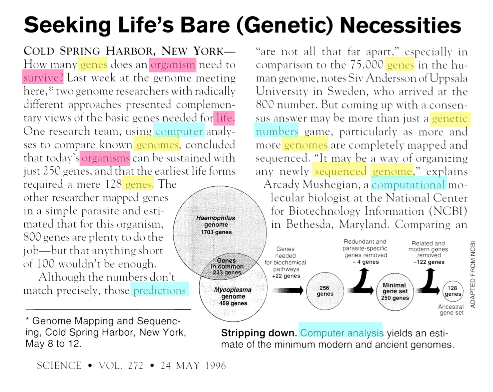
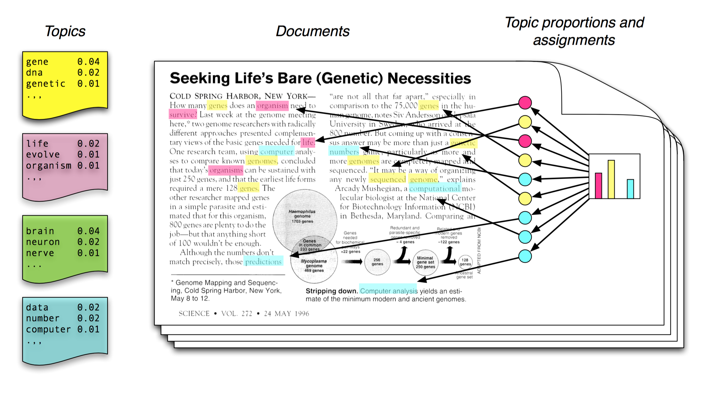
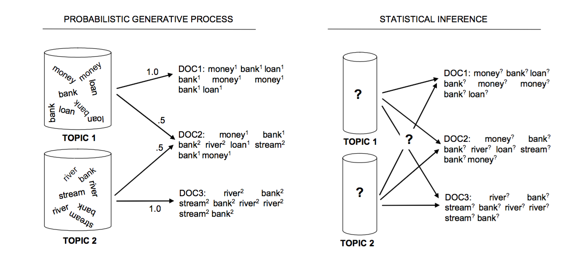
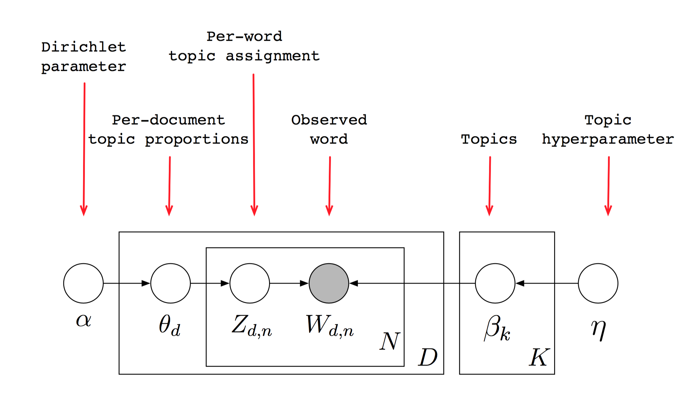
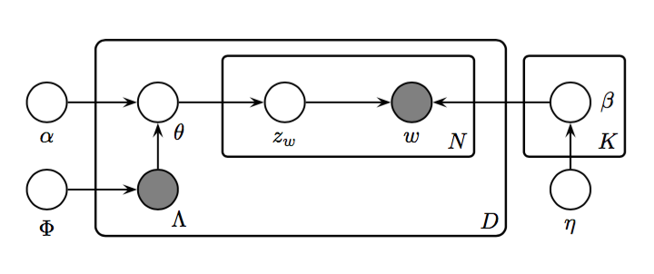

### Named Entity Recognition and Classification[NERC]
through

Latent Dirichlet Allocation[LDA]

<hr/>
<span style="color:maroon">Praveen Kumar Srinivasan</span>


Notes:

-----

### Overview of Presentation
<hr/>

Notes:
- Intro to Topic Modelling
- What is LDA?
- Why LDA?
- NER Techniques
- LDA in NER: Labelled LDA
- Advantages and Disadvantages

---

### Multi-Dimensional Exploratory Search on Unstructured Data
<hr/>

- **Multi-Dimensional Queries** are those queries that span over a specific semantic field or over multiple semantic fields of interest, but contains multiple items of interest.

```
Where can I watch a movie and have good Chinese food?
```

-----

### Twitter Data Characteristics

- **Length**: Maximum Length of a tweet is 140 characters.
- **Language**: They are hand typed, have misspellings, slang, emojis, abbreviations.
- **Open Domain**: The tweets can be on any topic.
- **Volume & Velocity**: The magnitude and speed of the data is vast.

---

### Key Problems
<hr/>

- Knowledge Extraction
    + <span style="color:maroon">Named Entity Recognition and Classification</span>
    + Word Sense Disambiguation
    + Textual Entailment
    + Coherence Resolution
- Personalization, Socialization, Contextualization, Localisation
- Temporal Reasoning, Statistical Paraphrasing
- Semantic relation and type

Notes:

---

### Current Work
<hr/>

Named Entity Recognition and Classification (NERC)

on

Twitter Data

---

### Traditional NERC Systems
<hr/>

- Use <span style="color:maroon">structure or grammar</span> to extract Named Entities
- Early systems relied on heuristics, while the modern system resort to machine learning
- Challenges: training datasets, previously unseen entities
- Supervised Learning rely on large training corpus
- Unsupervised learning techniques rely on lexical pattern, contextual statistics and features
- Rule based systems are preferred when there are not enough training samples

---

### Different Approaches
<hr/>

- Training data
    + Tagged corpus
- Lexical Resources
    + WordNet, Wikipedia, Freebase
- Grammar or Rules
    + Contains (Mr.), ContainsAlpha(U.S)
- Lexical Patterns
    + Collocation, Prefix, Postfix
- White-List or Dictionaries
    + Celebrities, City, Movies

-----

### Features used in NERC
<hr/>

- **Boolean Attribute** (isWordCapital)
- **Numeric Attribute** (lenOfWord)
- **Word Level Attributes** (case, punctuation, digits, characters, word endings, POS, morphology)
- **Document/Corpus Level Attributes** (word frequency, document frequency, co-occurrences, position in the text)
- **Lookup Attributes** (StopWords, dictionary lookup, abbreviations, prefix, postfix, location)

---

### Shortcoming of Traditional NERC Systems
<hr/>

- Dependency on Well-formed language structure
- Need for large training data
- Need for updated lexical resources
- Handling unseen patterns

---

### Characteristics of Social Media Data
<hr/>

- Slang
- Abbreviations
- Emojis
- HashTags
- Character Repetition
- Uppercase Characters

-----

### Twitter Data Features
<hr/>

- Social Circle
- Extended Social Circle
- Popularity of the tweet
- Popularity of the tweeter
- Trending HashTags
- Presence of HashTags
- Collocation with other HashTags
- Temporal Features
- Context: HashTags, search terms, user's social circle, extended social circle

---

### NERC on Twitter Data
<hr/>

- Current state-of-the-art:
    + Usage of <span style="color:maroon">global trends</span> and <span style="color:maroon">local trends</span>
    + Handle cases where lexical resources fail
    + Shortcomings
        + Do not classify the entity type
        + Do not consider HashTags

---

### How am I going to solve?
<hr/>

- Unsupervised Learning/Semi-Supervised Learning
- Address shortcoming of traditional NERC systems
- Classify entities across open-domain
- Handle cases where:
    + lexical resources fail
    + not enough training data
    + rules would be hard to frame

---

### Unsupervised Learning
<hr/>

Latent Dirichlet Allocation[LDA]

---

### What is LDA ?
<hr/>

- Generative Probabilistic Process
- Mixed Membership Model
- Introduced by David Blei, Andrew Ng, Micheal Jordan in 2003
- There are different variation of LDA based on constraints used

-----

### Generative Probabilistic Model
<hr/>

- Treats data as observations that arise from a generative probabilistic process that includes hidden variables
- Infer the hidden variables using posterior inference
- Fit the new data into the estimated model

---

### LDA - Intuition
<hr/>



<small>Source: LDA - David Blei, Andrew Ng, Micheal Jordan</small>

---

### Generative Model
<hr/>



- Each document is a mixture of topics
- Each word is drawn from one of these topics

<small>Source: LDA - David Blei, Andrew Ng, Micheal Jordan</small>

-----

### Generative Model
<hr/>

- Topic model are based on the idea that documents are mixture of topics
- Here, Topics are a probability distribution over words.
- Topic model is a generative model for documents
- To make a new document:
    + choose a distribution of topics.
    + Then, to get each word in the document, choose a topic randomly from this distribution
    + and draw a word from that topic.

---

### Posterior Distribution
<hr/>


- In reality, we have documents and want to infer the topics from which these documents were generated.
- Hence, we use statistical techniques to invert this process.

Notes:
<small>Source: LDA - David Blei, Andrew Ng, Micheal Jordan</small>
- Our goal is to infer the underlying Topics

---

### LDA : Plate Notation
<hr/>



<small>Source: LDA - David Blei, Andrew Ng, Micheal Jordan</small>

-----

### LDA Notations


Variable                           | Meaning
---------------------------------- | ---------------------------------------------------------------------------------
$ K $                              | number of topics (e.g. 50)
$ V $                              | number of words in the vocabulary (e.g. 50,000 or 1,000,000)
$ D $                              | number of documents
$ N_{d=1 \dots D} $                | number of words in document **d**
$ N $                              | total number of words in all documents; sum of all $ N_d $ values


-----

Variable                           | Meaning
---------------------------------- | ---------------------------------------------------------------------------------
$ \alpha_{k=1 \dots K} $           | prior weight of topic **k** in a document; usually the same for all topics; normally a number less than 1, e.g. 0.1, to prefer sparse topic distributions, i.e. few topics per document
$ \eta_{w=1 \dots V} $             | prior weight of word **w** in a topic; usually the same for all words; normally a number much less than 1, e.g. 0.001, to strongly prefer sparse word distributions, i.e. few words per topic

Notes:
$ \boldsymbol\alpha $              | collection of all $\alpha_{k}$ values, viewed as a single vector

-----

Variable                             | Meaning
----------------------------------   | ---------------------------------------------------------------------------------
$ \beta_{k=1 \dots K} $              | distribution of words in topic **k**
$ \theta_{d=1 \dots D} $             | distribution of topics in document **d**
$ \beta_{k=1 \dots K,w=1 \dots V} $  | probability of word **w** occurring in topic **k**
$ \theta_{d=1 \dots D,k=1 \dots K} $ | probability of topic **k** occurring in document **d** for any given word

Notes:
$ \boldsymbol\beta $                 | collection of all $ \beta_w $ values, viewed as a single vector

-----

Variable                             | Meaning
----------------------------------   | ---------------------------------------------------------------------------------
$ z_{d=1 \dots d,w=1 \dots n_d} $    | topic of word **w** in document **d**
$ w_{d=1 \dots D,w=1 \dots N_d} $    | word **w** in document **d**
$ \mathbf{Z} $                       | topic of all words in all documents
$ \mathbf{W} $                       | all words in all documents

---

### Joint Distribution for all the Documents in the Corpus
<hr/>

<math xmlns="http://www.w3.org/1998/Math/MathML" display="block">
    <mo stretchy="false">(</mo>
    <munderover>
        <mo>&#x220F;
            <!-- ∏ -->
        </mo>
        <mrow class="MJX-TeXAtom-ORD">
            <mi>k</mi>
            <mo>=</mo>
            <mn>1</mn>
        </mrow>
        <mrow class="MJX-TeXAtom-ORD">
            <mi>K</mi>
        </mrow>
    </munderover>
    <mi>p</mi>
    <mo stretchy="false">(</mo>
    <msub>
        <mi>&#x03B2;
            <!-- β -->
        </mi>
        <mi>k</mi>
    </msub>
    <mrow class="MJX-TeXAtom-ORD">
        <mo stretchy="false">|</mo>
    </mrow>
    <mi>&#x03B7;
        <!-- η -->
    </mi>
    <mo stretchy="false">)</mo>
    <mo stretchy="false">)</mo>
    <mo stretchy="false">(</mo>
    <munderover>
        <mo>&#x220F;
            <!-- ∏ -->
        </mo>
        <mrow class="MJX-TeXAtom-ORD">
            <mi>d</mi>
            <mo>=</mo>
            <mn>1</mn>
        </mrow>
        <mrow class="MJX-TeXAtom-ORD">
            <mi>D</mi>
        </mrow>
    </munderover>
    <mi>p</mi>
    <mo stretchy="false">(</mo>
    <msub>
        <mi>&#x03B8;
            <!-- θ -->
        </mi>
        <mi>d</mi>
    </msub>
    <mrow class="MJX-TeXAtom-ORD">
        <mo stretchy="false">|</mo>
    </mrow>
    <mi>&#x03B1;
        <!-- α -->
    </mi>
    <mo stretchy="false">)</mo>
    <mo stretchy="false">(</mo>
    <munderover>
        <mo>&#x220F;
            <!-- ∏ -->
        </mo>
        <mrow class="MJX-TeXAtom-ORD">
            <mi>n</mi>
            <mo>=</mo>
            <mn>1</mn>
        </mrow>
        <mrow class="MJX-TeXAtom-ORD">
            <mi>N</mi>
            <mi>d</mi>
        </mrow>
    </munderover>
    <mi>p</mi>
    <mo stretchy="false">(</mo>
    <msub>
        <mi>z</mi>
        <mrow class="MJX-TeXAtom-ORD">
            <mi>d</mi>
            <mo>,</mo>
            <mi>n</mi>
        </mrow>
    </msub>
    <mrow class="MJX-TeXAtom-ORD">
        <mo stretchy="false">|</mo>
    </mrow>
    <msub>
        <mi>&#x03B8;
            <!-- θ -->
        </mi>
        <mi>d</mi>
    </msub>
    <mo stretchy="false">)</mo>
    <mo stretchy="false">(</mo>
    <mi>p</mi>
    <mo stretchy="false">(</mo>
    <msub>
        <mi>w</mi>
        <mrow class="MJX-TeXAtom-ORD">
            <mi>d</mi>
            <mo>,</mo>
            <mi>n</mi>
        </mrow>
    </msub>
    <mrow class="MJX-TeXAtom-ORD">
        <mo stretchy="false">|</mo>
    </mrow>
    <msub>
        <mi>z</mi>
        <mrow class="MJX-TeXAtom-ORD">
            <mi>d</mi>
            <mo>,</mo>
            <mi>n</mi>
        </mrow>
    </msub>
    <mo>,</mo>
    <msub>
        <mi>&#x03B2;
            <!-- β -->
        </mi>
        <mi>k</mi>
    </msub>
    <mo stretchy="false">)</mo>
    <mo stretchy="false">)</mo>
    <mo stretchy="false">)</mo>
    <mo stretchy="false">)</mo>
</math>

Notes:
$$
(\prod_{k=1}^{K}p(\beta_k|\eta))(\prod_{d=1}^{D}p(\theta_d|\alpha)(\prod_{n=1}^{Nd}p(z_{d,n}|\theta_d)(p(w_{d,n}|z_{d,n},\beta_k))))
$$


---

### Labelled LDA : Plate Notation
<hr/>



<small>Labeled LDA: Daniel Ramage, David Hall, Ramesh Nallapati and Christopher D. Manning</small>

-----

### Labelled LDA Notations

Variable                           | Meaning
---------------------------------- | ---------------------------------------------------------------------------------
$ \phi_{k=1 \dots K} $             | labelling prior probability for topic **k**
$ \Lambda_{d=1 \dots D} $          | list of binary topic presence/absence indicators for each document **d**

---

### Labelled LDA Model

---

### My Approach

- Local and Global Features
- Use Freebase and Wikipedia
- Use Supervised Input Features
- Ensemble approach

---

### Advantages and Disadvantages

---

### Thats all! (For Now!)

Thanks and Feedbacks

